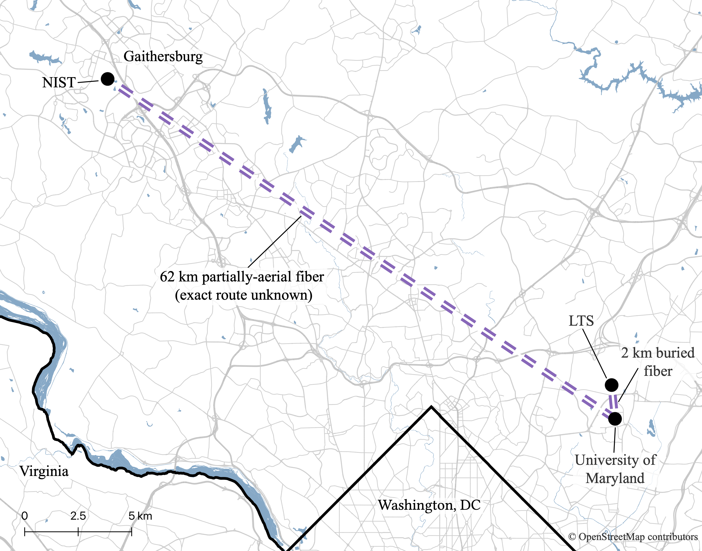
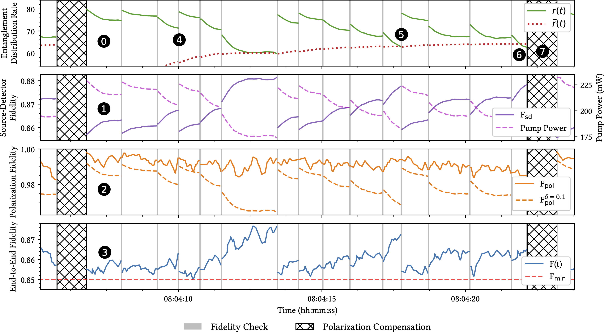

# Rate-Fidelity Control for Wide-Area Quantum Links

This repository contains simulation code and experimental data for the paper **Rate-Fidelity Control for Wide-Area Quantum Links.**

The protocol provides a stable link layer service by dynamically managing the tradeoff between entanglement generation rate and end-to-end fidelity over a wide-area quantum link.

This repository provides the event-driven simulator used to evaluate the protocol, experimental source characterization and polarization drift data, models derived from those measurements, and scripts for generating the datasets and figures used in the paper.

## Paper

[Read the paper on arXiv](https://arxiv.org/abs/XXXX.XXXXX)


## Repository Contents

```text
.
├── data/
│   ├── 9_29-10_2_2023(Polarization) (Cs Reference, LTS GM, Star Top., ZEN_LEN)/
│   │   ├── 1539 Polarization Data/  # Measured polarization traces     
│   │   └── WeatherData/             # Associated weather data
│   └── MIRA_source_characterization/ # Entanglement source characterization data
└── src/
    ├── sim.py                       # Simulation engine
    ├── generate_dataset.py          # Builds the polarization trace dataset
    ├── hardware.py                  # Source rate/fidelity vs pump power models
    ├── polarization_drift.py        # Polarization drift calculations
    ├── drift_predictor.py           # Drift prediction utilities
    ├── apc_sim.py                   # APC simulation
    ├── plot_polarization.py         # Recreates the polarization drift figure
    ├── plot_static.py               # Generates static results plots
    ├── plot_by_Fmin.py              # Generates results by fidelity threshold plot
    ├── plot_sim.py                  # Simulation plotting helpers
    ├── utils.py                     # Dataset loading and shared utilities
    └── models/
        └── drift_prediction_model.npz # Saved polarization drift prediction model

```

## Setup

All code is written in Python. Python 3.14 or newer is recommended.

To get started, create and activate a virtual environment, then install the required dependencies:

```bash
python -m venv .
source ./bin/activate
python -m pip install -r requirements.txt
```

Then generate the dataset. This will take a few minutes.

```bash
cd src
python -m generate_dataset
```

## Reproducing Paper Figures

Once you have generated the dataset, you can recreate the figures from the paper. To recreate the polarization drift plot (Fig. 5), run:

```bash
python -m plot_polarization
```

To recreate the main source characterization plot (Fig. 4a), run:

```bash
python -m hardware
```

To recreate an unpolished version of the example simulation run in Fig. 6, run:

```bash
python -m plot_static
```

To recreate the static results plots (Fig. 7), run:

```bash
python -m plot_static
```

To recreate the dynamic results plots (Fig. 8), run:

```bash
python -m plot_by_Fmin
```

## Running Simulations

Simulations are run through `sim.py`:

```bash
python -m sim
```

Simulation settings can be changed by editing the `settings` dictionary at the bottom of `src/sim.py`.

## Contact

Please contact Connor Clayton (cbclayto@cs.umd.edu) with any questions.

[](link_map.png)

[](example-run.png)